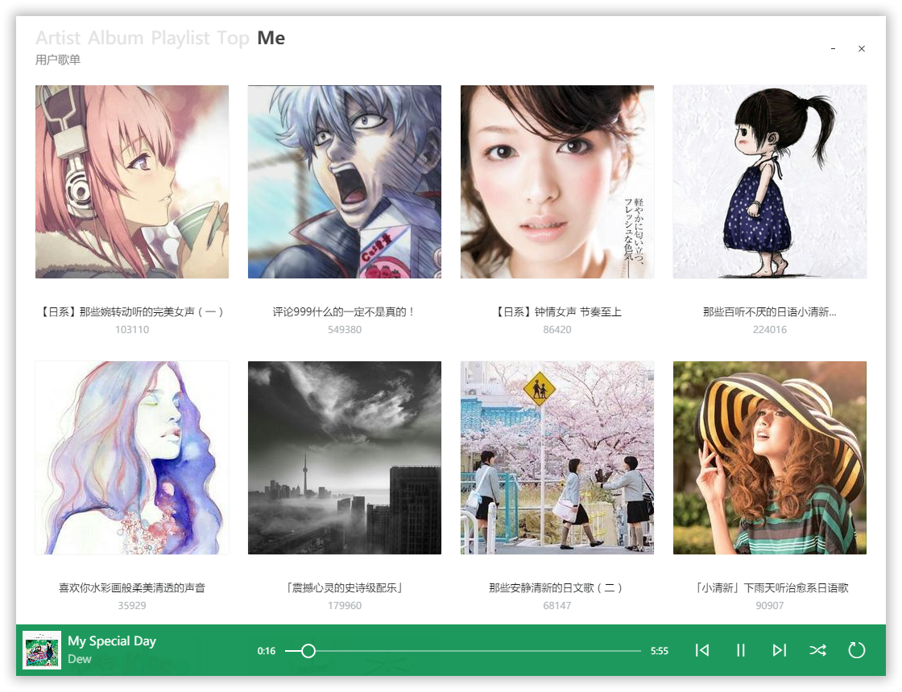

# Glee
Built by Electron, Vanilla JS, Plain CSS
> 主要是感觉 "目前最好的网易云音乐客户端 [trazyn/ieaseMusic](https://github.com/trazyn/ieaseMusic)" 不太和我审美

## Description
- 基于 Electron, Windows 专属
- 原生 JS, 手写 CSS
- 只能算是个播放器, 像 [listen1/listen1](https://github.com/listen1/listen1) 这样
- 数据来自网易云音乐API, 搬了[Binaryify/NeteaseCloudMusicApi](https://github.com/Binaryify/NeteaseCloudMusicApi/blob/master/util/crypto.js), [sqaiyan/netmusic-node](https://github.com/sqaiyan/netmusic-node/blob/master/crypto.js)的加密源码
- 不能登录的, 主要是不会写, 还有邮箱登录 API 被封了?
- 界面抄的巨硬家的 Groove Music (还直接偷了 iconfont 用)
- 还没有写搜索

## Feature
- 好看
- 大概能用 (感觉还差很多呢, 先这样吧)
- 下载歌曲写入ID3 Tag (灵感来自[codezjx/netease-cloud-music-dl](https://github.com/codezjx/netease-cloud-music-dl))

## Dependencies
- ~~[jariz/vibrant.js](https://github.com/jariz/vibrant.js)~~
- ~~[chengyin/albumcolors](https://github.com/chengyin/albumcolors)~~
- ~~[briangonzalez/rgbaster.js](https://github.com/briangonzalez/rgbaster.js)~~
- [marijnvdwerf/material-palette](https://github.com/marijnvdwerf/material-palette)
- [lokesh/color-thief](https://github.com/lokesh/color-thief/)
- [Binaryify/NeteaseCloudMusicApi](https://github.com/Binaryify/NeteaseCloudMusicApi) , [sqaiyan/netmusic-node](https://github.com/sqaiyan/netmusic-node)
- [Zazama/node-id3](https://github.com/Zazama/node-id3)

## Preview

