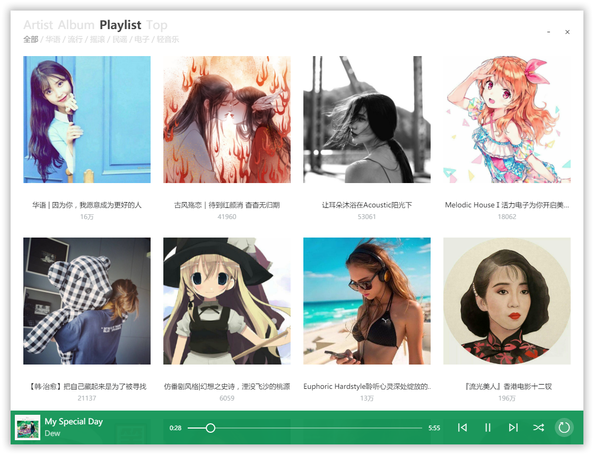
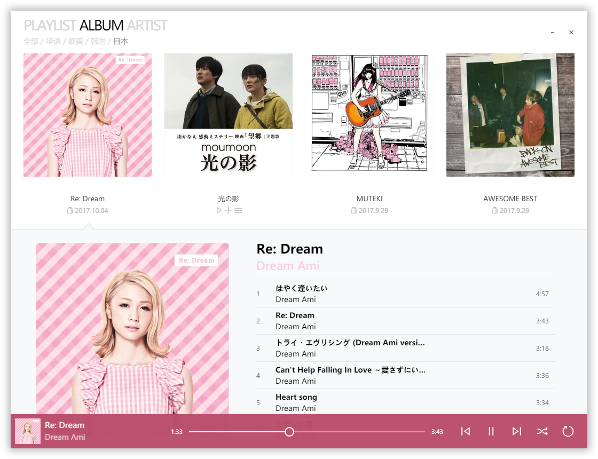
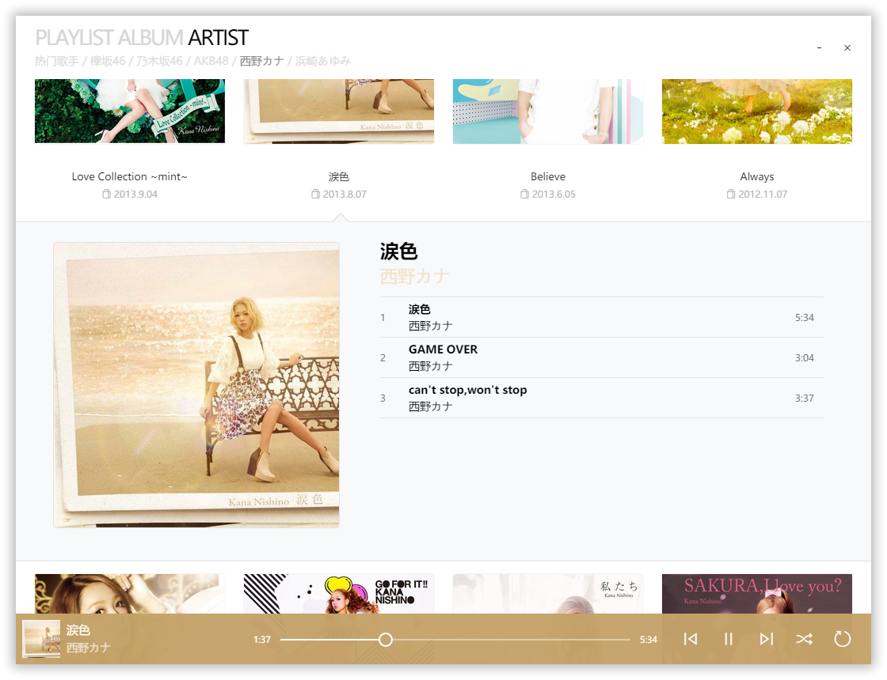
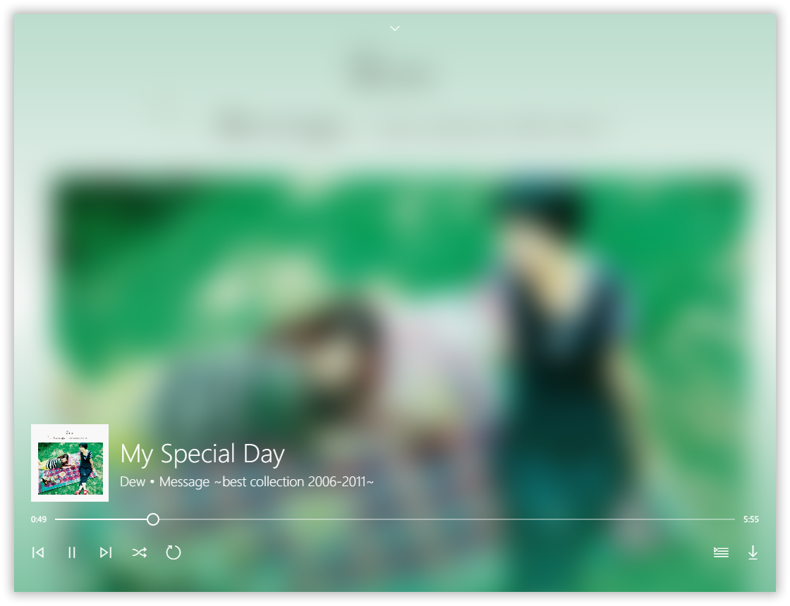
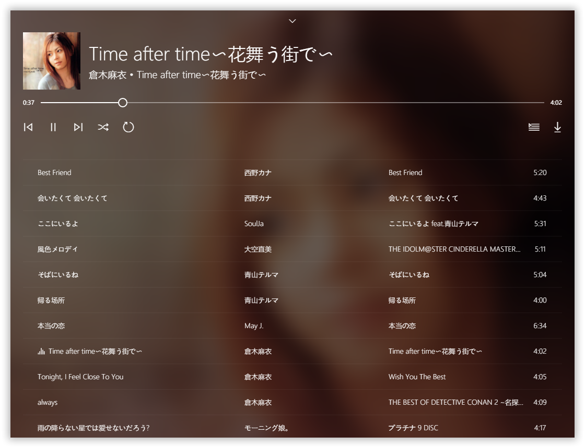

# Glee
Built by Electron, Vanilla JS, Plain CSS  
*The logo is a rebound of [Music Service Branding - G](https://dribbble.com/shots/1203920-Music-Service-Branding-G) by [Zack McBride](https://dribbble.com/zMcBride) in [Dribbble](https://dribbble.com/)*
> 勉强算是 "目前最好的网易云音乐客户端 [trazyn/ieaseMusic](https://github.com/trazyn/ieaseMusic)" 的竞品


## Description
- 基于Electron，~~Windows专属~~
- 原生JS，手写CSS，啥框架都不会用
- 界面抄袭巨硬家的Groove Music (还直接偷了iconfont用)
- 数据来自网易云音乐API，搬了[Binaryify/NeteaseCloudMusicApi](https://github.com/Binaryify/NeteaseCloudMusicApi/blob/master/util/crypto.js)，[sqaiyan/netmusic-node](https://github.com/sqaiyan/netmusic-node/blob/master/crypto.js)的加密源码
- 不能登录的，主要是不会写，还有邮箱登录API被封了对吧？
- 因为不能登录所以就只算个播放器吧，像[listen1/listen1](https://github.com/listen1/listen1)这样
- API里不登录能用的大概都用上了
- 等有空再加上搜索吧

## Feature
- 好看
- 播放条随专辑封面变色
- 启动时还原上次播放状态
- 解锁网页端大部分变灰歌曲 (奇特姿势来自[JixunMoe/netease-cloud-music-api](https://github.com/JixunMoe/netease-cloud-music-api))
- 解锁小部分收费歌曲 (奇特姿势来自[dinjia/userscript](https://github.com/dinjia/userscript))
- 下载歌曲写入ID3 Tag (灵感来自[codezjx/netease-cloud-music-dl](https://github.com/codezjx/netease-cloud-music-dl))
- 快捷键支持

Description            | Keys
-----------------------| -----------------------
暂停/播放              | <kbd>Space</kbd>
上一曲                 | <kbd>Ctrl</kbd> <kbd>←</kbd>
下一曲                 | <kbd>Ctrl</kbd> <kbd>→</kbd>

## Personalize
由于懒，而且菜，还没想法怎么样在界面录入信息比较好看  
暂时还是写死在[js/user.js](./js/user.js)的代码里，需要自己手动改  
包括用户id，关注的歌手id (默认我是自己的)    

## Run&Package

```
$ npm install
$ .\node_modules\.bin\electron-rebuild.cmd
$ npm start
$ npm run package-win
$ npm run package-mac
$ npm run package-linux
```
> 关于排版和显示效果，因为初心是为Windows写的，用的也是Groove Music的样子，所以使用Windows自带字体微软雅黑，按雅黑尺寸来排版布局。而在linux上和macOS上都不自带微软雅黑，想要较好的显示效果请自行下载安装字体，这里提供[下载地址](https://drive.google.com/open?id=0B8K7gdEWY7snRE9LQU5wU0ltYTA)(Google Drive)，提取自自己的Windows 10系统文件夹。

## References
- ~~[jariz/vibrant.js](https://github.com/jariz/vibrant.js)~~  
感觉很有名，描述是"a javascript port of the awesome Palette class in the Android support library"。不过对比安卓上Phonograph的变色效果，总觉得不太理想，就把issue翻了个遍。按照描述自然感觉是从java的palette类翻译过来的，结果发现作者说是基于color-thief实现的，标题党立功了？另外作者有提到material-palette，用了下感觉确实比这个好
- ~~[chengyin/albumcolors](https://github.com/chengyin/albumcolors)~~  
本来展开详情想实现iTunes12.3的样式，就找了个这个库。当然还有别的node包，比如[arcanis/colibrijs](https://github.com/arcanis/colibrijs)，但是node不能读dom，感觉重复请求比较浪费就都没有node包。不过这都不是事儿，自己偷懒实现了简版的发现实在太难看了(封面质量层次不齐，当然也有可能是我的问题)，于是换了iTunes12.9的展开样式，就用不到这个了。还有作者都没有控制canvas的大小，图片太大会卡，一开始还不知道怎么取个色就阻塞了呢？？？
- ~~[briangonzalez/rgbaster.js](https://github.com/briangonzalez/rgbaster.js)~~  
最初的起点，百度搜到的，试过跟vibrant.js差不多效果，(emmm其实是从它的issue里知道vibrant.js的)，取多色色板时比较废，弃了弃了
- [marijnvdwerf/material-palette](https://github.com/marijnvdwerf/material-palette)  
描述是"colour extraction library，based on the Palette support library"，作者说用js翻译了绝大部分palette库的java代码，感觉就非常有诚意了。然而跟Phonograph还是有些差距(翻过[Phonograph的源码](https://github.com/kabouzeid/Phonograph/blob/master/app/src/main/java/com/kabouzeid/gramophone/util/PhonographColorUtil.java)，好像就是直接用了palette类？并没有其它优化算法？这么简单？好羡慕！)，有时还是蜜汁取色，不过相比之下效果还可以，也有可能是心里作用吧
- [lokesh/color-thief](https://github.com/lokesh/color-thief/)  
emmm还用这个主要是取主色比较方便，虽然直接用主色会有可读性问题，不过用的地方不是特别重要，只求效果
- [Binaryify/NeteaseCloudMusicApi](https://github.com/Binaryify/NeteaseCloudMusicApi) , [sqaiyan/netmusic-node](https://github.com/sqaiyan/netmusic-node)  
能扒到网易云API真是给这些大佬跪了，自己试过在source里跟踪调试，非常头大，原地爆炸，也可能是我太菜的缘故。。。话说有些接口没说type参数可以取哪些啊，好吧我不该要求这么高的
- [Zazama/node-id3](https://github.com/Zazama/node-id3)  
写ID3 tag用，好像最近是才出的包，看到npm上相关的好多好多，反正它是google搜到的第一个，也懒着挑了。最开始用的时候还只有同步的模式，我想怎么放歌的时候会卡一下，现在更新后有异步调用了，完美
- [electron-userland/electron-json-storage](https://github.com/electron-userland/electron-json-storage)  
用来保存场景了，感觉这个有同步的才好啊，但却只有异步的。现在为了退出前保存设了一个flag，搞得一刷新就保存好退出了。。。调试巨麻烦，写代码的时候还是注释掉了

## License
MIT

## Preview
> 因为自己用了[MacType](https://github.com/snowie2000/MacType)，所以和大家的显示效果可能有点不一样  








